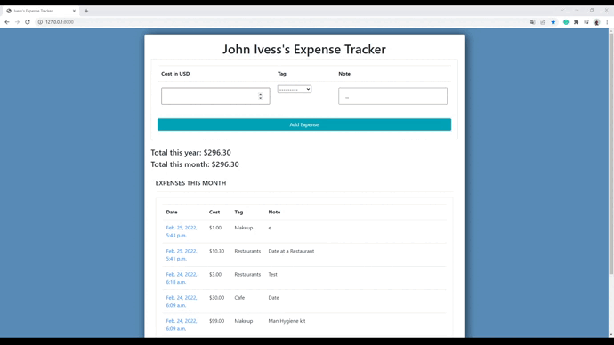

# django-expense-tracker
### A small expense tracker application made by [Ivan "John Ivess" Shyika](https://www.youtube.com/c/JohnIvess).

#### Check it out:
[Expense Tracker Website](https://ivess-contactlist.herokuapp.com/) (powered by Heroku)

[Expense Tracker on GitHub](https://github.com/IvessJohn/django-expense-tracker) (this page)

## Demo

_*You can see more demo materials in [publicity/](publicity/) directory_

---

## Functionality:
- See your previous expenses
- Add new expenses choosing their category and optionally adding a note
    - Supports a short form (via home page) and a full one (via a special page)
- Open expense logs for more information
    - See the expense note
    - Edit the expense information

Every expense instance contains this information:
- Date
- Cost
- Category/Tag
- Note (optional)

---
**Used tools**: Django, Python.
